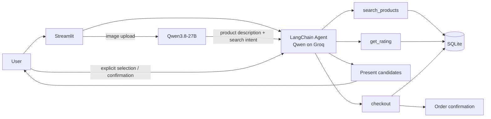

# Architecture

## Design goal

AI Shopping Agent is a small agentic-commerce prototype designed around one core rule: **the language model orchestrates the workflow, but deterministic application code owns data access and writes**.

That means the model can decide *which tool to call*, while product search, rating lookup, and order persistence still happen through explicit Python functions backed by SQLite.



## Component responsibilities

| Component | Responsibility | Does not own |
| --- | --- | --- |
| `app.py` | Streamlit chat state, rendering, image upload | Product logic or model policy |
| `agent.py` | Model configuration, tool definitions, agent instructions | UI rendering |
| `search_products` | Keyword / price / organic catalog filtering | Recommendation prose |
| `get_rating` | Deterministic review aggregation | Product selection |
| `describe_product_image` | Convert an image into search intent | Catalog access |
| `checkout` | Persist a demo order | Payment processing |
| `data/store.db` | Products, reviews, demo orders | Agent reasoning |

## Request paths

### Text request

```text
user request
   ↓
agent interprets constraints
   ↓
search_products
   ↓
get_rating for candidates
   ↓
agent presents qualifying products
   ↓
user selects / confirms
   ↓
checkout
```

### Image request

```text
uploaded image
   ↓
describe_product_image
   ↓
product type + search query + organic signal
   ↓
normal text-search pipeline
```

The image path intentionally converges into the same catalog-search path as text input. This avoids maintaining two separate recommendation systems.

## Action boundary

The current prototype uses an **agent-policy confirmation boundary**. The system instructions tell the agent not to call `checkout` while browsing and to wait for explicit user confirmation.

That is useful for demonstrating guarded agent behavior, but it is important to distinguish it from a hard application-level control. A production transaction system should enforce confirmation **outside the LLM** with an explicit state machine or authorization check before any write-capable tool is allowed to execute.

This distinction is one of the main architectural lessons from the project: prompt policy can guide behavior, but consequential actions should ultimately be protected by deterministic application logic.

## Conversation-to-record mapping

The agent includes each product's database ID in the displayed candidate list. A later command such as `order #2` is resolved against IDs already surfaced in the conversation instead of asking the model to invent a record identifier.

In a larger system, this would be stronger as typed session state containing candidate IDs rather than relying on formatted conversation text.

## Data layer

SQLite keeps the demo easy to inspect and run locally. The database contains:

- products
- customer reviews
- demo orders

Search and rating calculations are deterministic Python/SQL operations. The LLM receives the results rather than directly querying or mutating the database itself.

## Failure modes and trade-offs

| Risk | Current behavior | Production hardening |
| --- | --- | --- |
| Model chooses an unexpected tool | Agent instructions constrain expected behavior | Tool authorization + state machine |
| Vision model misidentifies a product | Poor search intent may reduce result quality | Confidence threshold / user confirmation |
| Product selection is ambiguous | IDs are included in displayed results | Typed candidate state in session |
| SQLite write contention | Acceptable for a single-user demo | Hosted transactional database |
| Model/provider outage | Request fails at model call | Retries, timeout policy, fallback model |
| API quota exhaustion | Public demo can fail | Usage limits, telemetry, fallback behavior |

## Testing strategy

The current automated tests focus on components that can be verified deterministically without an LLM call:

- catalog integrity
- known product availability
- rating aggregation
- batch rating ordering

GitHub Actions runs those tests on pushes and pull requests.

What is not yet covered:

- tool-selection regression tests
- end-to-end multi-turn agent behavior
- image-understanding evaluation
- checkout-policy violations

Those are the next tests I would add before treating the agent as production-ready.

## Production evolution

A production version would likely move toward:

```text
Streamlit / web client
        ↓
application service
        ↓
explicit workflow state machine
        ↓
agent / model decision support
        ↓
authorized tools
        ↓
hosted product + inventory + order services
```

The most important change would be moving write authorization out of prompt instructions and into deterministic application state.
