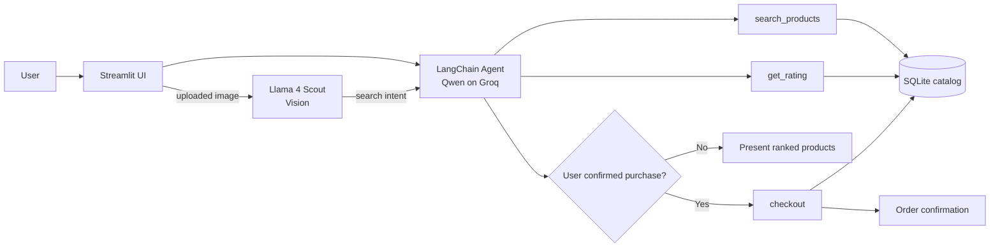

# AI Shopping Agent

[](https://ai-shopping-agent-fvz8dpwpsfrihivomnkcz2.streamlit.app/)
[](https://github.com/chaitanya4595-afk/ai-shopping-agent/actions/workflows/tests.yml)


> A multimodal, tool-using shopping assistant that searches a catalog, checks ratings, understands product images, and follows an explicit-confirmation policy before demo checkout.

**Why this project matters:** the LLM does not own business data or transaction logic. It orchestrates the workflow, while deterministic tools handle search, ratings, and checkout. That separation makes the system easier to reason about, test, and extend.

## Try it in 60 seconds

**Live app:** https://ai-shopping-agent-fvz8dpwpsfrihivomnkcz2.streamlit.app/

1. Enter: `I want organic honey under $20 with a 4.5+ rating`
2. The agent searches the catalog and checks ratings before presenting candidates.
3. Reply with `order #1` or `yes` to exercise the confirmation-to-checkout path.
4. Upload `docs/sample_images/honey.png` to test the multimodal search flow.

The catalog and checkout are demo data/actions; no real payment is processed.

## System flow



## What I engineered

- **Tool-based agent orchestration** — the model chooses when to search, retrieve ratings, inspect an image, or execute checkout.
- **Multimodal routing** — a vision model converts an uploaded image into product-search intent, then reuses the same search pipeline as text input.
- **Policy-level checkout guardrail** — agent instructions separate browsing from checkout and require explicit confirmation before the write-capable tool is called.
- **Deterministic data access** — catalog search, rating aggregation, and order persistence happen through SQLite-backed Python tools rather than free-form model output.
- **Multi-turn resolution** — displayed product IDs let follow-up requests such as `order #2` map back to a specific record.
- **Deployable UI** — Streamlit provides a conversational interface for both text and image-based shopping.

## Engineering decisions

| Decision | Why I made it | Trade-off |
| --- | --- | --- |
| Keep search/ratings/checkout outside the LLM | Business data and writes stay deterministic | More application code than a prompt-only prototype |
| Require explicit confirmation before checkout | Demonstrates a guarded action workflow | Currently enforced by agent policy; production should enforce it in application state |
| Preserve product IDs in agent responses | Makes follow-up selection resolvable | Conversation format becomes part of the agent contract |
| Reuse the text search path after image understanding | Avoids duplicate recommendation logic | Vision quality can affect downstream search quality |
| Use SQLite for the demo | Simple, inspectable, easy to run locally | Not suitable for high-concurrency production commerce |

## Reliability and testing

The automated tests intentionally focus on deterministic components that can be verified without consuming model API credits:

- catalog integrity
- known demo-product availability
- single-product rating aggregation
- batch rating aggregation and requested-ID ordering

CI runs the test suite on every push and pull request through GitHub Actions.

**Current testing gap:** the repository does not yet include a full end-to-end agent evaluation suite. A production version should add tool-call regression tests, structured outputs, trace-based evaluation, and application-level authorization around checkout.

## Technology stack

| Technology | Role |
| --- | --- |
| Python | Application and tool logic |
| LangChain | Agent and tool orchestration |
| Groq / Qwen | Main reasoning model |
| Llama 4 Scout | Product-image understanding |
| SQLite | Products, reviews, and demo orders |
| Streamlit | Conversational UI and deployment |
| pytest | Deterministic component tests |
| GitHub Actions | Continuous test execution |
| uv | Dependency and environment management |

## Repository map

```text
.
├── app.py                         # Streamlit entry point
├── src/ai_shopping_agent/
│   ├── agent.py                   # Models, tools, and agent policy
│   └── reviews.py                 # Deterministic rating logic
├── data/store.db                  # Demo catalog, reviews, orders
├── scripts/setup_db.py            # Rebuild demo database
├── docs/sample_images/            # Images for multimodal testing
├── tests/                         # Deterministic component tests
├── ARCHITECTURE.md                # Deeper system design notes
├── pyproject.toml
└── .github/workflows/tests.yml    # CI
```

For a deeper technical walkthrough, see [ARCHITECTURE.md](ARCHITECTURE.md).

## Run locally

```bash
git clone https://github.com/chaitanya4595-afk/ai-shopping-agent.git
cd ai-shopping-agent
uv sync --extra dev
cp .env.example .env
```

Add your Groq API key to `.env`:

```env
GROQ_API_KEY=your_key_here
```

Run the app:

```bash
uv run streamlit run app.py
```

Run tests:

```bash
uv run pytest
```

## Limitations and next upgrades

Current limitations:

- small static demo catalog rather than a live retailer inventory
- demo checkout only; no payment processing
- SQLite rather than a hosted transactional database
- model and vision outputs can vary
- confirmation is currently an agent-policy rule rather than a hard application state gate
- no end-to-end agent benchmark yet

The next engineering upgrades I would make are structured tool outputs, application-level checkout authorization, inventory-aware transactions, trace/evaluation tooling, integration tests, and a hosted database with user-specific carts.
