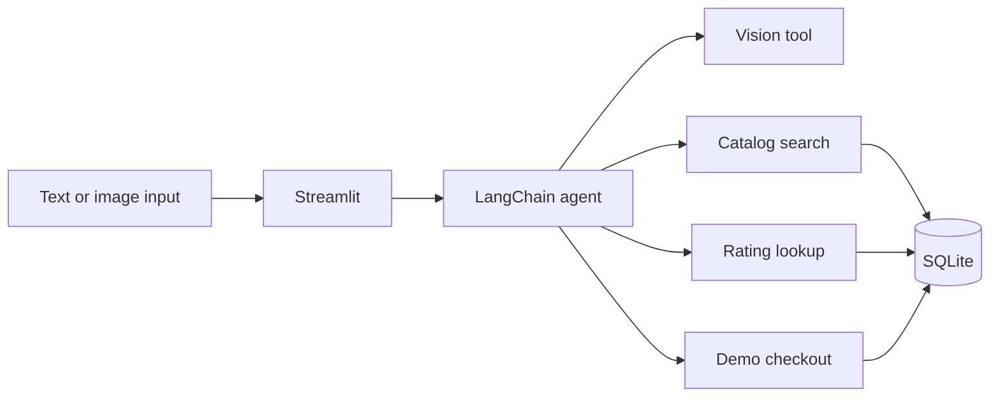

# AI Shopping Agent

[About me](https://github.com/kcrokkam) · [My other projects](https://github.com/kcrokkam/agentic-ai-projects)

I built a shopping assistant that can search a catalog, check ratings, identify products from an image, and place a demo order. I wanted to explore how an LLM coordinates several tools while keeping product data and transaction logic in ordinary Python code.

The app supports text and image input through Streamlit. LangChain handles the agent loop, Groq serves the language and vision models, and SQLite stores the catalog, reviews, and demo orders.

[Open the app](https://ai-shopping-agent-fvz8dpwpsfrihivomnkcz2.streamlit.app/) · [Architecture](ARCHITECTURE.md) · [Tests](tests/)

## Try it

1. Enter `I want organic honey under $20 with a 4.5+ rating`.
2. Review the products and ratings the agent returns.
3. Reply with `order #1` to try the demo checkout.
4. Upload an image from [docs/sample_images](docs/sample_images/) to search visually.

The catalog is sample data and checkout does not process a real payment.

## How I built it



I kept search, ratings, and checkout outside the model. The agent decides when to call them, but the tools return catalog data and carry out database operations. Product IDs let a user refer back to an item in a follow-up message.

For image input, a vision model identifies the product and the agent uses that information in the same catalog-search workflow as a text request. The checkout instructions require confirmation before ordering. That rule currently lives in the agent prompt; enforcing it in application state is an improvement I would make before supporting real transactions.

## Code structure

| File or folder | Responsibility |
| --- | --- |
| `app.py` | Streamlit conversation and image upload |
| `src/ai_shopping_agent/agent.py` | Models, tools, and agent instructions |
| `src/ai_shopping_agent/reviews.py` | Rating calculations |
| `data/store.db` | Sample catalog, reviews, and orders |
| `scripts/setup_db.py` | Database setup |
| `tests/` | Catalog and rating tests |

## Run locally

Use Python 3.12 and [uv](https://docs.astral.sh/uv/).

```bash
git clone https://github.com/kcrokkam/ai-shopping-agent.git
cd ai-shopping-agent
uv sync --extra dev
cp .env.example .env
```

Set `GROQ_API_KEY` in `.env`, then run:

```bash
uv run streamlit run app.py
```

## Testing and limitations

```bash
uv run pytest
```

I test catalog integrity, known sample products, and single/batch rating calculations without calling a model. [GitHub Actions](https://github.com/kcrokkam/ai-shopping-agent/actions/workflows/tests.yml) runs those checks on pushes and pull requests.

I have not added an end-to-end agent evaluation set yet. The current application also uses a small static catalog, SQLite, and prompt-level checkout confirmation. My next steps are tool-call regression tests, an application-level confirmation gate, and better handling of inventory and user-specific carts.
